# Design Document

## Overview

This design document outlines the transformation of UpPaws into "UpPaws: Animal Trainer" - a Pokémon-inspired animal collection and battle game that meets Reddit's Developer Platform games featuring program standards. The enhanced UpPaws will evolve from a simple daily puzzle into an immersive animal training RPG with creature collection, turn-based battles, habitat exploration, and deep progression systems while maintaining educational value about real animals.

### Core Concept: Pokémon-Style Animal Training

Players become Animal Trainers who discover, collect, and train real-world animals through puzzle-solving mechanics. Each successfully solved animal puzzle "captures" that animal to your collection, where they can be trained, evolved, and used in strategic turn-based battles against other trainers.

## Architecture

### System Architecture

```mermaid
graph TB
    A[Reddit Devvit Platform] --> B[UpPaws Animal Trainer Engine]
    B --> C[Collection System]
    B --> D[Battle System]
    B --> E[Exploration System]
    B --> F[Social & Community]
    B --> G[Progression & Economy]
    
    C --> C1[Animal Discovery]
    C --> C2[Puzzle Capture]
    C --> C3[Collection Management]
    C --> C4[Evolution System]
    
    D --> D1[Turn-Based Combat]
    D --> D2[Type Effectiveness]
    D --> D3[Trainer Battles]
    D --> D4[Tournament System]
    
    E --> E1[Habitat Exploration]
    E --> E2[Daily Expeditions]
    E --> E3[Rare Animal Encounters]
    E --> E4[Environmental Challenges]
    
    F --> F1[Reddit Integration]
    F --> F2[Trainer Communities]
    F --> F3[Trading System]
    F --> F4[Leaderboards]
    
    G --> G1[Trainer Levels]
    G --> G2[Animal Training]
    G --> G3[Item System]
    G --> G4[Achievements]
```



### Data Flow Architecture

The enhanced system will maintain the existing Redis-based storage while adding structured data management for new features:

- **User Profiles**: Extended user data including levels, achievements, preferences
- **Content Management**: Expanded animal database with categorization and educational content
- **Session Management**: Enhanced gameplay tracking and analytics
- **Social Data**: Community challenges, tournaments, and sharing metrics

## Components and Interfaces

### 1. Animal Collection & Discovery System

#### Puzzle-Based Capture Mechanics
- **Discovery Mode**: Explore different habitats to encounter wild animals
- **Puzzle Battles**: Solve increasingly complex animal name puzzles to "capture" creatures
- **Capture Success**: Difficulty and time affect capture rate and animal stats
- **Rare Encounters**: Special animals with unique puzzle mechanics and higher difficulty

#### Collection Management
- **Animal Storage**: Personal collection with detailed stats and information
- **Evolution System**: Animals can evolve into related species through training and battles
- **Breeding Mechanics**: Combine compatible animals to discover new species
- **Shiny Variants**: Rare color variants with special visual effects

### 2. Turn-Based Battle System

#### Combat Mechanics
- **Type System**: Animals have habitat types (Land, Water, Air, etc.) with effectiveness charts
- **Move Sets**: Each animal has 4 learnable moves based on their real-world behaviors
- **Stats System**: Health, Attack, Defense, Speed, and Intelligence stats
- **Status Effects**: Conditions like Sleep, Confusion, Poisoned based on animal abilities

#### Battle Modes
- **Wild Battles**: Encounter and battle wild animals during exploration
- **Trainer Battles**: Challenge other Reddit users to strategic battles
- **Gym Leaders**: Special NPC battles themed around subreddit moderators
- **Tournament Battles**: Competitive events with leaderboards and prizes

### 3. Habitat Exploration System

#### World Map
- **Biome Regions**: Forest, Ocean, Desert, Arctic, Jungle, Savanna, Mountain habitats
- **Daily Expeditions**: Limited exploration attempts that refresh daily
- **Hidden Areas**: Unlock secret locations through achievements and progression
- **Weather Effects**: Dynamic weather affects which animals can be encountered

#### Environmental Challenges
- **Habitat Puzzles**: Solve ecosystem-based challenges to access rare areas
- **Conservation Missions**: Educational quests about wildlife protection
- **Research Tasks**: Collect data about animals for in-game scientists
- **Seasonal Events**: Time-limited areas with exclusive animals

### 4. Social & Community Features

#### Reddit Integration
- **Trainer Profiles**: Showcase your collection and achievements on Reddit
- **Battle Replays**: Share epic battles as Reddit posts with embedded viewers
- **Community Challenges**: Subreddit-wide goals and collaborative events
- **Trading Posts**: Reddit-based marketplace for animal trading

#### Multiplayer Systems
- **Friend Lists**: Connect with other trainers through Reddit usernames
- **Guilds/Teams**: Join subreddit-based trainer organizations
- **Cooperative Raids**: Team up to battle legendary animals
- **Mentorship**: Experienced trainers can guide newcomers

### 5. Trainer Progression System

#### Trainer Levels & Badges
- **Experience System**: Gain XP through captures, battles, and exploration
- **Gym Badges**: Defeat habitat-themed gym leaders to earn progression badges
- **Elite Four**: Ultimate challenge against the strongest trainers in each region
- **Champion Status**: Become the regional champion and defend your title

#### Animal Training & Development
- **Level Up System**: Animals gain experience and stats through battles
- **Move Learning**: Animals learn new moves as they level up or through training
- **Evolution Chains**: Multi-stage evolution paths for many animal species
- **Individual Values**: Each animal has unique hidden stats affecting potential

#### Trainer Specialization
- **Habitat Mastery**: Specialize in specific biomes for bonuses and exclusive content
- **Research Path**: Focus on discovery and education for unique rewards
- **Battle Path**: Competitive focus with tournament access and battle bonuses
- **Conservation Path**: Environmental missions and rare animal access

### 6. Economy & Item System

#### In-Game Currency
- **PawCoins**: Earned through battles, captures, and daily activities
- **Research Points**: Gained through educational activities and discoveries
- **Battle Tokens**: Competitive currency for tournament entry and rewards

#### Items & Equipment
- **Capture Items**: Puzzle hints, time extensions, and capture rate boosters
- **Battle Items**: Healing potions, stat boosters, and strategic consumables
- **Training Equipment**: Items that enhance animal growth and learning
- **Cosmetic Items**: Trainer customization and animal accessories

#### Trading System
- **Animal Trading**: Exchange animals with other trainers through Reddit
- **Item Marketplace**: Buy and sell items using in-game currency
- **Auction House**: Bid on rare animals and exclusive items
- **Gift System**: Send items and animals to friends

### 7. Reddit Featuring Requirements Compliance

#### Compelling First Screen
- **Custom Splash Screen**: Animated trainer selection with habitat preview
- **Onboarding Tutorial**: Interactive guide teaching core mechanics
- **Immediate Engagement**: First capture experience within 30 seconds

#### Cross-Platform Excellence
- **Responsive Design**: Seamless experience on mobile and desktop
- **Touch Optimization**: Intuitive gesture controls for mobile users
- **Performance Scaling**: Adaptive graphics quality based on device capabilities

#### Self-Explanatory Design
- **Visual Clarity**: Clear icons and intuitive UI elements
- **Progressive Disclosure**: Gradually introduce complex features
- **Contextual Help**: In-game tooltips and guidance system

#### No-Scroll Interface
- **Viewport Optimization**: All content fits within screen boundaries
- **Smart Layouts**: Adaptive UI that works in all orientations
- **Efficient Navigation**: Tab-based interface with clear sections

## Data Models

### Trainer Profile
```typescript
interface TrainerProfile {
  username: string;
  trainerId: string;
  level: number;
  experience: number;
  badges: Badge[];
  specialization: TrainerPath;
  stats: TrainerStats;
  inventory: Item[];
  currency: Currency;
  achievements: Achievement[];
  preferences: TrainerPreferences;
  socialData: SocialData;
}
```

### Animal Data Model
```typescript
interface Animal {
  id: string;
  speciesId: string;
  name: string;
  nickname?: string;
  level: number;
  experience: number;
  stats: AnimalStats;
  moves: Move[];
  type: HabitatType[];
  rarity: Rarity;
  shiny: boolean;
  evolutionStage: number;
  captureDate: Date;
  trainerId: string;
  individualValues: IV;
}
```

### Battle System Model
```typescript
interface Battle {
  battleId: string;
  type: BattleType;
  participants: Trainer[];
  teams: Animal[][];
  currentTurn: number;
  battleState: BattleState;
  moves: BattleMove[];
  result?: BattleResult;
  replay: BattleReplay;
}
```

### Habitat & Exploration Model
```typescript
interface Habitat {
  id: string;
  name: string;
  type: HabitatType;
  description: string;
  availableAnimals: AnimalEncounter[];
  unlockRequirements: Requirement[];
  weatherEffects: WeatherEffect[];
  specialEvents: Event[];
  explorationCost: number;
}
```
```

## Error Handling

### Graceful Degradation
- **Offline Mode**: Cache puzzles for offline play when network is unavailable
- **Performance Optimization**: Reduce visual effects on lower-end devices
- **Connection Recovery**: Seamless reconnection with data synchronization

### User Experience Protection
- **Progress Preservation**: Never lose user progress due to technical issues
- **Fair Play**: Anti-cheat measures and validation systems
- **Accessibility**: Support for screen readers and alternative input methods

## Testing Strategy

### Automated Testing
- **Unit Tests**: Core game logic and scoring algorithms
- **Integration Tests**: Reddit API interactions and data persistence
- **Performance Tests**: Load testing for concurrent users and large datasets

### User Experience Testing
- **A/B Testing**: Feature rollouts and engagement optimization
- **Accessibility Testing**: Compliance with web accessibility standards
- **Cross-Platform Testing**: Consistent experience across devices and browsers

### Community Testing
- **Beta Programs**: Early access for engaged community members
- **Feedback Integration**: Systematic collection and implementation of user suggestions
- **Moderation Tools Testing**: Ensure community management features work effectively

## Performance Considerations

### Scalability Design
- **Efficient Data Structures**: Optimized Redis usage for large user bases
- **Caching Strategies**: Smart caching of frequently accessed content
- **Load Distribution**: Balanced resource usage across game sessions

### Mobile Optimization
- **Touch Interface**: Responsive design optimized for mobile interaction
- **Battery Efficiency**: Minimize resource usage for longer play sessions
- **Network Efficiency**: Reduce data usage while maintaining rich experience

## Security & Privacy

### Data Protection
- **User Privacy**: Minimal data collection with transparent usage policies
- **Secure Storage**: Encrypted sensitive data and secure API communications
- **GDPR Compliance**: User data rights and deletion capabilities

### Fair Play Systems
- **Anti-Cheat**: Server-side validation of all game actions
- **Rate Limiting**: Prevent abuse of scoring and progression systems
- **Moderation Tools**: Community management and content filtering

## Monetization Strategy

### Premium Trainer License
- **Expanded Storage**: Increased animal collection capacity
- **Exclusive Habitats**: Access to premium exploration areas
- **Advanced Training**: Accelerated animal growth and special moves
- **Priority Matching**: Faster battle matchmaking and tournament entry

### Cosmetic & Customization
- **Trainer Outfits**: Themed clothing and accessories
- **Animal Accessories**: Cosmetic items for your animal companions
- **Habitat Themes**: Custom visual styles for exploration areas
- **Battle Effects**: Premium animations and victory celebrations

### Educational Partnerships
- **Wildlife Organization Content**: Sponsored habitats and conservation missions
- **Zoo Partnerships**: Real-world animal photos and exclusive content
- **Research Institution Data**: Scientific accuracy and educational value
- **Conservation Impact**: Portion of revenue donated to wildlife protection

### Competitive Features
- **Tournament Passes**: Entry to premium competitive events
- **Coaching Services**: AI-powered battle strategy recommendations
- **Replay Analysis**: Advanced battle statistics and improvement suggestions
- **Exclusive Tournaments**: High-stakes competitions with rare animal prizes
##
 Innovation & Reddit-Unique Features

### Puzzle-Battle Hybrid Mechanics
- **Dynamic Difficulty**: Puzzle complexity adapts to animal rarity and trainer skill
- **Combo Captures**: Chain successful puzzles for bonus capture rates and rare encounters
- **Environmental Puzzles**: Habitat-specific challenges that teach ecosystem relationships
- **Collaborative Solving**: Team up with other trainers to solve legendary animal puzzles

### Reddit-Native Social Features
- **Subreddit Gyms**: Each participating subreddit becomes a themed gym with custom challenges
- **Moderator Champions**: Subreddit mods become gym leaders with unique animal teams
- **Community Discoveries**: New animals unlocked through collective subreddit achievements
- **Cross-Subreddit Events**: Inter-community competitions and collaborative expeditions

### Educational Innovation
- **Conservation Impact Tracking**: Real-world conservation donations tied to in-game achievements
- **Citizen Science Integration**: Contribute to actual wildlife research through gameplay
- **Expert AMAs**: Wildlife biologists and conservationists host special in-game events
- **Virtual Field Trips**: Explore real wildlife locations through 360° habitat experiences

## Community Engagement Strategy

### Content Creation Incentives
- **Battle Replay Sharing**: Automatic Reddit post generation for epic battles
- **Collection Showcases**: Beautiful infographics of trainer achievements and rare animals
- **Strategy Guides**: Community-created content with in-game rewards for helpful posts
- **Fan Art Integration**: Player-created animal artwork featured in-game

### Viral Mechanics
- **Daily Global Challenges**: Worldwide goals that require community cooperation
- **Legendary Sightings**: Rare animal appearances that create community excitement
- **Trainer Spotlights**: Feature exceptional players and their stories on Reddit
- **Meme Integration**: Popular animal memes become special in-game events and content

### Long-Term Retention
- **Seasonal Storylines**: Ongoing narrative arcs that unfold over months
- **Legacy Features**: Long-term goals that take dedication to achieve
- **Mentorship Programs**: Experienced players guide newcomers for mutual rewards
- **Community Governance**: Player voting on new features and content direction

## Technical Implementation Roadmap

### Phase 1: Core Transformation (Months 1-3)
- Implement basic animal collection and battle systems
- Create compelling splash screen and onboarding experience
- Establish habitat exploration framework
- Build Reddit integration for sharing and community features

### Phase 2: Social & Competitive (Months 4-6)
- Launch trainer battles and tournament systems
- Implement trading and social features
- Create subreddit gym system with moderator integration
- Add achievement and progression systems

### Phase 3: Advanced Features (Months 7-9)
- Introduce breeding and evolution mechanics
- Launch premium features and monetization
- Add advanced battle strategies and meta-game depth
- Implement educational partnerships and conservation features

### Phase 4: Community & Innovation (Months 10-12)
- Roll out user-generated content systems
- Launch cross-platform competitive leagues
- Introduce AR/VR exploration features
- Establish long-term content pipeline and community governance

## Success Metrics & KPIs

### Engagement Metrics
- **Daily Active Users**: Target 50,000+ DAU within 6 months
- **Session Length**: Average 15+ minutes per session
- **Retention Rates**: 70% Day 1, 40% Day 7, 20% Day 30
- **Community Participation**: 30% of users engage with Reddit features

### Revenue Targets
- **Premium Conversion**: 5% of active users subscribe to premium features
- **Average Revenue Per User**: $2.50 monthly across all users
- **Tournament Participation**: 25% of users participate in competitive events
- **Educational Impact**: Partner with 10+ conservation organizations

### Community Growth
- **Subreddit Adoption**: 100+ subreddits actively hosting UpPaws content
- **User-Generated Content**: 1000+ community posts per month
- **Cross-Platform Sharing**: 50% of achievements shared outside the game
- **Educational Engagement**: 80% of users read animal facts and conservation content