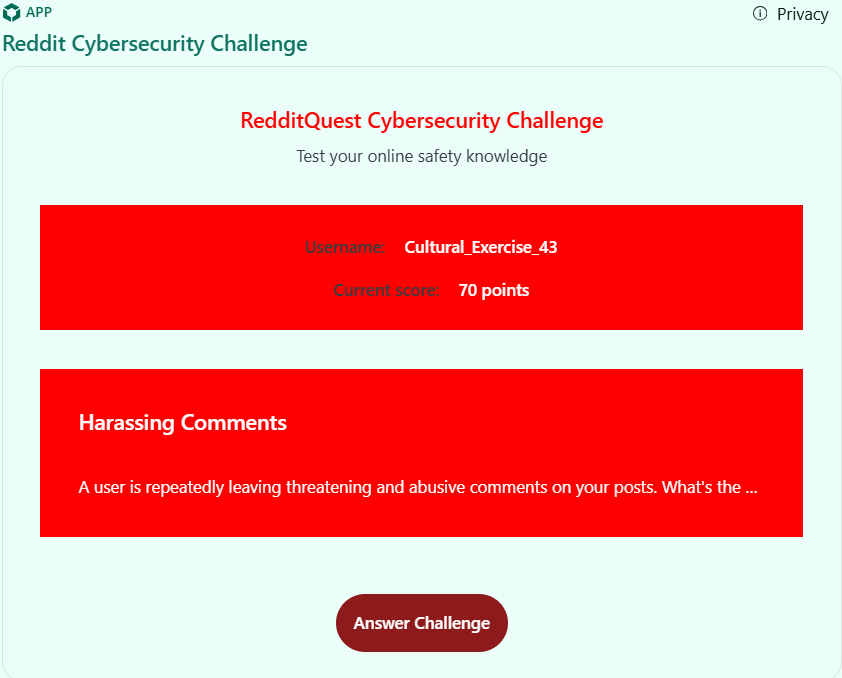
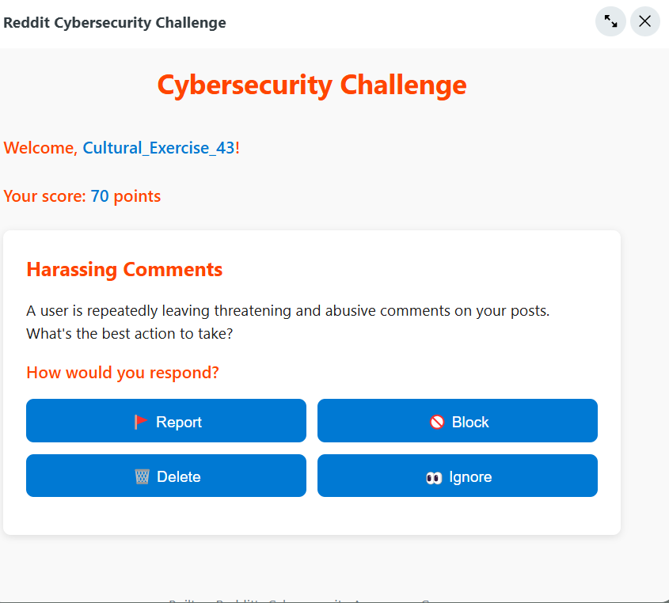
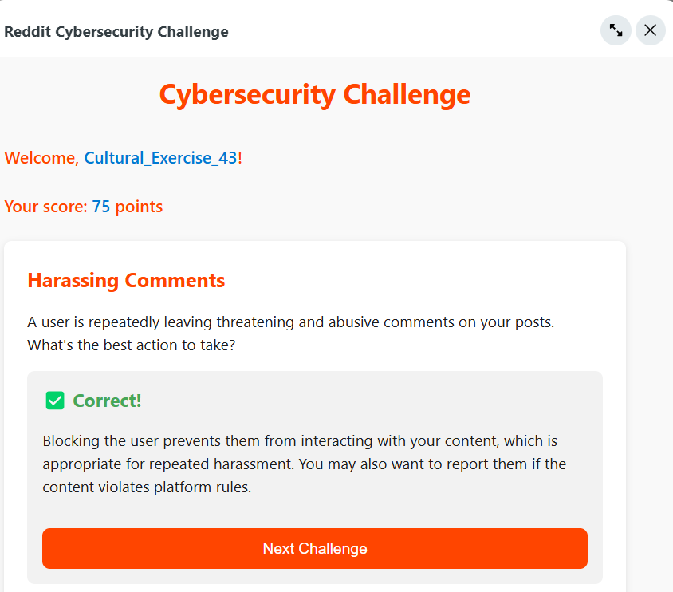

# 🛡️ RedditQuest: Cybersecurity Awareness Game

A dynamic, interactive game promoting cybersecurity awareness through engaging Reddit-integrated challenges. Built for Reddit's hackathon using the Devvit platform.

<div align="center">
  
  <h3>Learn. Play. Stay Safe Online.</h3>
</div>

## 🌟 Features

- **Interactive Challenges**: Solve real-world cybersecurity scenarios
- **Score System**: Earn points for correct answers
- **Badge Rewards**: Unlock achievements as you progress
- **Progress Tracking**: Your scores are saved between sessions
- **Leaderboard**: Compete with others in your community
- **Reddit Integration**: Seamless experience within Reddit's platform
- **Moderator Tools**: Easy post creation for subreddit moderators

## 🎮 Gameplay

RedditQuest presents you with practical cybersecurity scenarios you might encounter online, such as:

- Suspicious friend requests
- Potential phishing emails
- Harassing comments
- Offensive content
- Accidental information exposure

For each challenge, you'll choose from four possible actions:
- 🚩 **Report**
- 🚫 **Block**
- 🗑️ **Delete**
- 👀 **Ignore**

Choose correctly to earn points and level up your cybersecurity expertise!

## 🚀 Getting Started

### For Subreddit Moderators

1. Install the RedditQuest app on your subreddit
2. Use the "Create New CyberQuest Challenge" option in the moderator tools
3. Engage your community with cybersecurity awareness!

### For Developers

#### Prerequisites
- [Node.js](https://nodejs.org/) (v14+)
- [npm](https://www.npmjs.com/) or [yarn](https://yarnpkg.com/)
- [Devvit CLI](https://developers.reddit.com/docs/devvit)

#### Installation

1. Clone the repository:
   ```bash
   git clone https://github.com/ayish1998/redditquest-app-game
   cd redditquest-app-game

### Game Interface Screenshots
  
   
    
     


### License
    MIT
