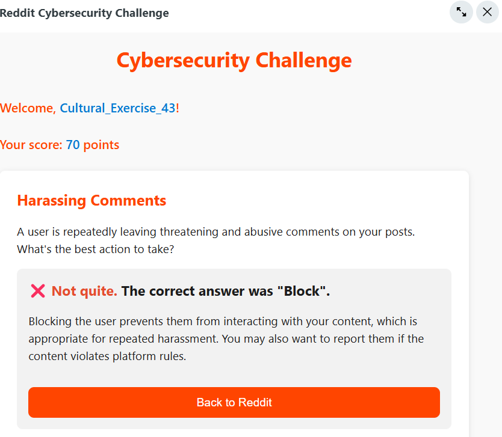

# 🐾 AnimalQuest: Animal Trivia for Redditors

A dynamic, interactive animal-trivia game with Reddit integration, built on Devvit. Answer fun multiple-choice questions, compete on the leaderboard, and learn cool animal facts.

<div align="center">
  
  <h3>Learn. Play. Stay Safe Online.</h3>
</div>

## 🌟 Features

- **Interactive Trivia**: Fun animal multiple-choice questions (A–D)
- **Score System**: Earn points for correct answers
- **Badge Rewards**: Unlock achievements as you progress
- **Progress Tracking**: Your scores are saved between sessions
- **Leaderboard**: Compete with others in your community
- **Reddit Integration**: Seamless experience within Reddit's platform
- **Moderator Tools**: Easy post creation for subreddit moderators

## 🎮 Gameplay

AnimalQuest presents animal trivia questions with four options (A–D). Pick the correct answer to earn points and see a fun fact. Answer via the embedded UI or by commenting A/B/C/D (or 1/2/3/4) on the post.

## 🚀 Getting Started

### For Subreddit Moderators

1. Install the AnimalQuest app on your subreddit
2. Use the "Create New AnimalQuest Trivia" option in the moderator tools
3. Engage your community with animal trivia!

### For Developers

#### Prerequisites
- [Node.js](https://nodejs.org/) (v14+)
- [npm](https://www.npmjs.com/) or [yarn](https://yarnpkg.com/)
- [Devvit CLI](https://developers.reddit.com/docs/devvit)

#### Installation

1. Clone the repository:
   ```bash
   git clone https://github.com/ayish1998/redditquest-app-game
   cd redditquest-app-game

### Game Interface Screenshots
  
   
    
     


### License
    MIT
